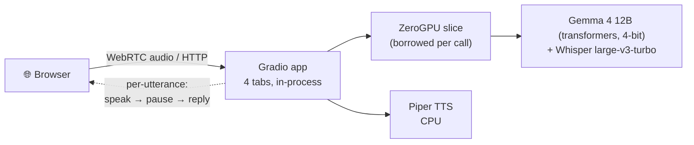
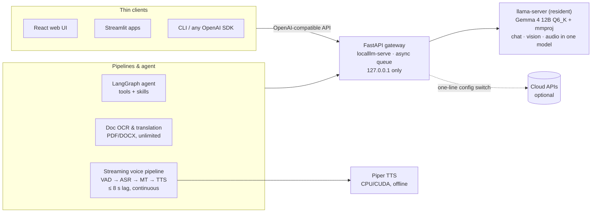

# LocalLLM: Demo vs. Full Version — at a glance

The [Hugging Face Space](https://huggingface.co/spaces) is a **reduced-capability showcase**
of [LocalLLM](https://github.com/murai1998/LocalLLM). It exists to let you try the core
experiences (live voice interpreting, multimodal chat, OCR, transcription) in a browser with
zero setup. The **full version** is a private, self-hosted AI platform that runs entirely on
your own hardware — no quotas, no per-token billing, no data ever leaving your machine.

## Key differences

| | 🤗 Showcase (this Space) | 🏠 Full LocalLLM |
|---|---|---|
| **Inference** | Per-call GPU borrowing (ZeroGPU): model state re-attached for every click | Resident `llama-server` with Gemma 4 12B **Q6_K GGUF** — always warm, ~10× faster |
| **Voice translation** | Per-utterance: speak → pause → hear translation | **Continuous streaming pipeline** (VAD → ASR → MT → sentence-queued TTS, ≤ 8 s lag) |
| **Architecture** | One Gradio app, models in-process | **OpenAI-compatible gateway** + thin clients (React web UI, Streamlit apps, any OpenAI SDK) |
| **Limits** | Daily GPU quota per visitor, 3 OCR pages, 5-min sessions | None |
| **Privacy** | Audio/images processed on HF infrastructure | **100 % offline** — gateway binds to localhost only |
| **Cost** | Free to try (HF quotas apply) | Free forever on your own GPU (NVIDIA CUDA or Apple Metal) |

## In the full version only

- 🤖 **Tool-using agent** — LangGraph ReAct agent with sandboxed file tools, web search &
  page fetch (SSRF-protected), and six pluggable **skills** (file-search, internet-access,
  media-convert, project-explorer, research-writer, system-status)
- 🌐 **OpenAI-compatible gateway** — one shared endpoint every app (or external client /
  IDE plugin) can call; async concurrency queue; swap local ↔ cloud (OpenAI/Azure/Anthropic)
  with one config line
- 💻 **React web UI** (Vite + Tailwind) and Streamlit apps, including a split-screen live
  translation view
- 📚 **Whole-document workflows** — unlimited-page OCR, native digital-PDF text extraction
  (PyMuPDF), and chunked **DOCX/PDF translation** that preserves document structure
- 🎧 **Long-form batch transcription** with overlap-aware chunking and local merge
- 📎 **Multi-file chat attachments** and unlimited context
- ⚙️ **Typed config profiles** — VRAM tuning (Q6_K/Q5_K), pydantic-settings, env overrides
- 🔌 **True offline operation** — pre-downloadable models and Piper voices, no network needed at runtime

## Architecture: showcase

One process, models attached per GPU call, pause-triggered voice loop, daily visitor quota.

## Architecture: full LocalLLM

One resident model behind a single gateway; everything else is a thin, replaceable client.
Continuous mic streaming with silence-aware segmentation instead of per-utterance turns.

---

**Try it locally:** clone [github.com/murai1998/LocalLLM](https://github.com/murai1998/LocalLLM),
follow the README — runs on an NVIDIA GPU workstation or Apple Silicon MacBook Pro.
